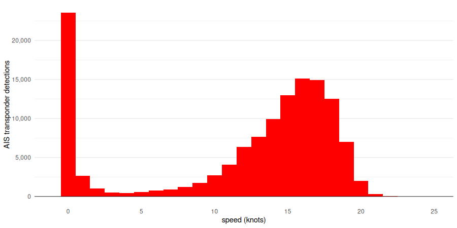

# Greenhouse gas emissions from shipping of US liquid natural gas exports

Data, methodology and and [R](https://www.r-project.org/) code for the analysis underlying [this Inside Climate News article](https://insideclimatenews.org/news/16042025/liquefied-natural-gas-exports-greenhouse-gas-emissions/), estimating methane and carbon dioxide emissions associated with the shipping of exports of LNG from the United States.

### Data for tankers exporting LNG from the US and isolation of tracking data for export journeys

U.S. exports of LNG have [expanded greatly since 2016](https://www.eia.gov/dnav/ng/hist/n9133us2m.htm), yet greenhouse gas emissions associated with the shipping of LNG are poorly understood. To estimate these emissions and understand how they have grown, we downloaded data on LNG exports [from the U.S. Department of Energy](https://www.energy.gov/fecm/articles/natural-gas-imports-and-exports-monthly-2024), selecting export journeys that began within two one-year time periods: between April 1, 2017 and March 31, 2018; and between between April 1, 2023 and March 31, 2024.

The DOE identifies LNG tankers by their names only — and ships may be renamed. To enable accurate joins to other data on the tankers, we annotated the export data to include a column with the vessels' unique International Maritime Organization codes at the time of each journey, with reference to the IMO's [Global Integrated Shipping Information System](https://webaccounts.imo.org/Common/WebLogin.aspx?App=GISISPublic) and the VesselFinder [vessels database](https://www.vesselfinder.com/vessels).

For information on the tankers' propulsion systems, delivery dates, and tank capacities, we extracted data on contemporary fleets from [annual World LNG Reports](https://www.igu.org/resource-list/report/) published by the International Gas Union.

We obtained automatic identification system (AIS) tracking data from [MarineTraffic](https://www.marinetraffic.com/), which supplied one transponder detection each day for LNG tankers for the same time periods as for our DOE export data.

The DOE data identified destination countries for each export, but not specific ports. To track export journeys to the ports involved, we downloaded data on LNG terminals from the Global Energy Monitor's [Global Gas Infrastructure Tracker](https://globalenergymonitor.org/projects/global-gas-infrastructure-tracker/).

The script `process_export_journey.R` joined the IGU data to the DOE export data and isolated the AIS tracking data for each journey. Given limits to the precision of location data for LNG terminals and because our daily AIS data did not always capture a ship in dock, after inspection of the data for a sample of \~75 vessels we determined that a destination had been reached when a tanker came within 20 kilometers of a potential destination port moving at a speed of less than 5 knots. (In cases where vessels spent an extended period maneuvering outside a port before docking, this means we may have called some outward legs of journeys as complete prematurely, which means that our subsequent calculations should be considered as conservative estimates.

Subsequent calculations of emissions depended in part on separating the cruising portions of export journeys from periods of maneuvering at slower speeds and time spent docked. Examination of the data on speed for all of the AIS tracking data provided by MarineTraffic revealed a bimodal distribution, with speeds above \~5 knots apparently representing the main distribution for vessels underway and observations at lower speeds presumably representing maneuvering.

So we adopted a cut-off of 5 knots, below which vessels were assumed to be maneuvering if not docked. Given that some documentation indicates faster maximum maneuvering speeds for LNG tankers, we also classified maneuvering with a cut-off of 10 knots, to allow a sensitivity analysis for subsequent emissions calculations. We gave a status of docked to any AIS transponder detections with zero speed within 20km of the location of a potential destination port, and to the first and last detection for each outward journey.

### Estimation of methane and carbon dioxide emissions for these export journeys

During the shipping of LNG, gas continually boils off and is generally burned in the ships' engines or used to generate steam, also used for propulsion. Some of this methane is not combusted and is emitted in a tanker's exhaust gases — a phenomenon called "methane slip." To estimate total greenhouse gas emissions, it is therefore necessary to include emissions of this methane as well as carbon dioxide emitted from the tankers' engines.

To estimate emissions for each export journey we adapted the methods described in [this 2023 scientific paper](https://pubs.acs.org/doi/abs/10.1021/acssuschemeng.3c04269), which depend on the distance traveled at cruising speed, the number of days spent maneuvering and docked, the tanker's propulsion system, its capacity, and its year of delivery. The script `calculate_emissions.R` includes the calculations detailed in the spreadsheet published in the [supporting information](https://pubs.acs.org/doi/10.1021/acssuschemeng.3c04269#_i17) for the paper. To calculate the distance traveled at cruising speed, we used the geodesic path through the location of consecutive AIS transponder detections, after filtering out detections at maneuvering speed. To convert methane emissions to carbon dioxide equivalent, we multiplied by 82.5, representing the 20-year global warming potential for methane, as described in the 2023 paper.

These methods do not allow calculation of emissions for slow-speed diesel with reliquefaction (SSDR) tankers. However, our export data contained only two tankers with SSDR propulsion, responsible for just three export journeys.

Estimating the total emissions associated with an export journey means accounting for the return as well as outward leg. Looking at our AIS tracking data, tankers' activity after an outward export journey from the U.S. varied — some made an immediate return to the U.S. while others subsequently traveled between LNG terminals in other countries. We also observed that some vessels had extended periods of maneuvering on their outward journeys, [which can happen](https://www.bbc.com/news/business-63331709) when ships are waiting for access to an LNG terminal or for a favorable price before they offload their cargo.

To standardize our emissions estimates, we assumed the same return path as the outward journey, 0.5 days of maneuvering for each destination port, plus one day additional maneuvering for each AIS transponder detection at maneuvering speed during the outward leg. This assumed that LNG tankers have no incentive for extended periods of maneuvering on their return legs. We also assumed one day docked for AIS transponder detection classed as docked in our data.

#### **Sensitivity analysis**

We summarized calculated emissions for each maneuvering cut-off speed.

#### 5 knots

| Year | Export journeys | Methane emissions (metric tons) | CO2 emissions (metric tons) | Total emissions, CO2 equivalent (metric tons) |
|---------------|---------------|---------------|---------------|---------------|
| 2017-2018 | 171 | 21,843 | 1,288,051 | 3,090,103 |
| 2023-2024 | 1,156 | 106,386 | 7,673,221 | 16,450,061 |

#### 10 knots

| Year | Export journeys | Methane emissions (metric tons) | CO2 emissions (metric tons) | Total emissions, CO2 equivalent (metric tons) |
|---------------|---------------|---------------|---------------|---------------|
| 2017-2018 | 171 | 21,950 | 1,300,390 | 3,111,225 |
| 2023-2024 | 1,156 | 107,122 | 7,738,442 | 16,576,050 |

These results were in strong concordance, with the 5 knot cut-off giving marginally more conservative estimates. For subsequent modeling and analysis, we assumed a 5 knot cut-off to define maneuvering speed.

### Modeling to predict emissions for export journeys with missing data

The methods described above provided emissions estimates for 1,327 of the 1,489 export journeys in the DOE data. For the remainder, we lacked complete AIS tracking data to make the calculations. To predict emissions of methane and carbon dioxide for these missing journeys, we built [XGBoost](https://xgboost.readthedocs.io/en/stable/) regression models, using as training variables the journey destination(s), year (2017-2018 or 2023-2024), plus the tankers' propulsion systems, capacities and years of delivery. These models explained \~80% of the variation in calculated emissions data. (But note methane and carbon dioxide emissions were [strongly correlated](plots/methane_co2_emissions_5kt_correlation.png), which may inflate performance metrics.) The script `model_emissions.R` shows how the models were tuned/trained.

After including predicted emissions for the remaining 161 journeys in our data, the calculated emissions, assuming a 5 knot cut-off for maneuvering speed, were:

| Year | Export journeys | Methane emissions (metric tons) | CO2 emissions (metric tons) | Total emissions, CO2 equivalent (metric tons) |
|---------------|---------------|---------------|---------------|---------------|
| 2017-2018 | 224 | 28,894 | 1,744,401 | 4,128,158 |
| 2023-2024 | 1,265 | 119,026 | 8,553,861 | 18,373,493 |

The script `model_emissions.R` also includes analysis of the outward bound distances traveled at cruising speed by year. These distances were longer for some destinations in 2023-2024 compared to 2017-2018, including Chile (average of 3,111 km or 31 percent longer), Taiwan (1,664 km or 16 percent longer), Japan (2,815 km or 15 percent longer), and China (2,943 km or 13 percent longer) This seems to be primarily a consequence of vessels being more likely to route via the southern tip of South America or South Africa rather than passing through the Panama Canal. These choices likely reflected disruption to shipping through the Panama Canal in 2023-2024 due to [drought–induced](https://www.carbonbrief.org/drought-behind-panama-canals-2023-shipping-disruption-unlikely-without-el-nino/) low water levels. We also observed some journeys in 2023-2024 routing via the Southern tip of Africa rather than passing through the Suez canal, which likely reflected concerns about [attacks on vessels](https://www.theguardian.com/world/2024/jan/03/what-is-the-red-sea-crisis-and-what-does-it-mean-for-global-trade) in the Red Sea by Houthi rebels in Yemen from October 2023.

To obtain a crude estimate of the effect of disruptions to shipping through the Panama Canal on greenhouse gas emissions, we recalculated emissions for return journeys to Chile, Taiwan, China, and Japan in 2023-2024, after subtracting twice the average increase in outward bound distances. For the 163 journeys to these countries for which we had outward leg distance data, the additional return distance traveled in 2023-2024 added less than half a million metric tons to total CO2 equivalent emissions.

### Mapping paths for selected export journeys

The [Inside Climate News article](https://) includes an interactive map showing the paths taken on the outward legs for selected export journeys, to illustrate the disruptions to shipping described above. The code to generate the data used is in the script `journey_maps.R`.

### Putting our emissions calculations in context

According to the Environmental Protection Agency's [Greenhouse Gas Equivalencies Calculator](https://www.epa.gov/energy/greenhouse-gas-equivalencies-calculato), 18,373,493 metric tons of CO2 equivalent emissions corresponds to the emissions of 4,285,714 gasoline-powered passenger vehicles or 16,226,604 electric-powered passenger vehicles driven for one year. Each gasoline-powered vehicle substituted with an EV therefore results in a reduction in emissions of `(16,226,604-4,285,714)/16,226,604` or 73.6 percent. So to offset the annual emissions associated with a year of U.S. LNG exports, you would need to substitute `4,285,714 / 0.736` or 5,822,981 gasoline-powered vehicles. According to the Department of Energy's Alternative Fuels Data Center, some [3,726,000 light-duty battery EVs](https://afdc.energy.gov/files/u/data/data_source/10963/10963_EV_range_efficiency_10-8-24.xlsx) were registered in the United States as of September 2024, so this exceeds the number of EVs driving on U.S. roads at the time by more than 50 percent.

(Note: These calculations do not include emissions associated with manufacturing the vehicles and disposing of them at the end of their useful life. These are [higher for EVs than for gasoline-powered vehicles](https://www.pnas.org/post/multimedia/point-does-driving-electric-vehicle-get-you-carbon-emissions-payoff), which means that the true number of EV substutitions needed to offset the emissions associated with U.S. LNG exports is actually somewhat greater than our conservative estimate.)

### Acknowledgements

Thanks to Kirsten Sinclair Rosselot, a chemical engineer and environmental performance analyst who runs the consultancy Process Profiles, first author of the [2023 paper](https://pubs.acs.org/doi/10.1021/acssuschemeng.3c04269) on LNG shipping emissions, for responding to queries on emissions calculations, and to Julia Silge of Posit PBC for helpful comments on the modeling to estimate emissions for export journeys with missing data.

### Questions/Feedback

Email Peter Aldhous at peter.aldhous\@insideclimatenews.org.
